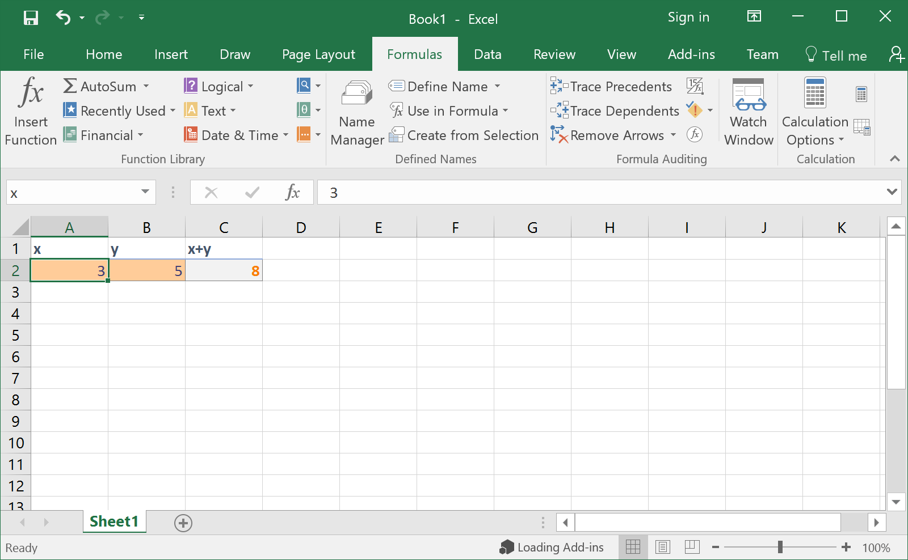

excel_wrapper
=============
An OpenMDAO 1.x Component for integrating Excel spreadsheets with OpenMDAO Problems.

Preparing an Excel Spreadsheet
------------------------------
Before adding an Excel Spreadsheet, you must name all the cells that you wish
to be exposed in your Excel Wrapper Component. You can do this in Excel in
one of two ways:

#. selecting a cell and then typing a name in the **Name Box** in the upper left
   portion of the Excel window, or

#. using the **Name Manager** tool in the **Formula** tab on the ribbon.

Any cells that are formulas will be interpreted as outputs; all others will be
interpreted as inputs.

   An Excel spreadsheet being prepared for use with the Excel Wrapper

